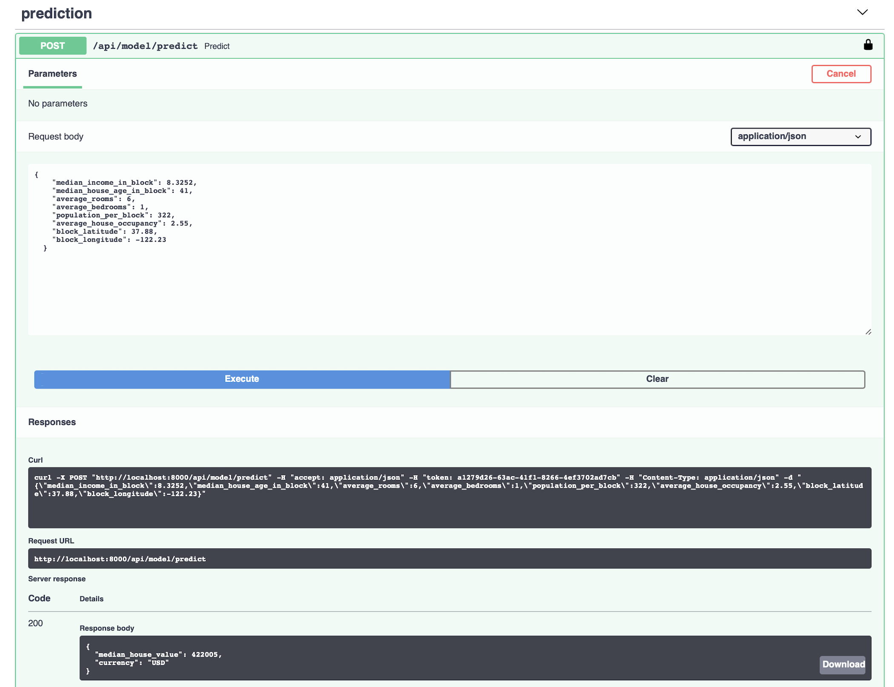

## Summary
I've created a GitHub repository named "fastapi-ml-skeleton" to simplify the deployment of machine learning models into production. Utilizing FastAPI, this project offers a robust framework for serving models securely and efficiently. The repository includes a tested example using a regression model for demonstrating house price predictions, targeting Python 3.11+ environments and employing Poetry for dependency management.

FastAPI creates a OpenAPI documention which you can directly use in Postman or generate code from for your client consuming this boilerplate code. 

## Highlights
- **FastAPI Framework**: Ensures fast, secure, and easy deployment.
- **Tested Sample Code**: Includes a regression model to get you started quickly.
- **Comprehensive Documentation**: Guides on installation, setup, and API usage.
- **Open Source**: Available under the Apache-2.0 license.

## Usage
To use this skeleton, clone the repository and follow the setup instructions provided. It covers everything from installation and running the local server to API authentication. This framework is designed to be scalable, allowing for easy expansion and integration of various machine learning models.

For more details, visit the [GitHub repository](https://github.com/eightBEC/fastapi-ml-skeleton).

For feedback, issues and pull requests, please refer to the linked repository.