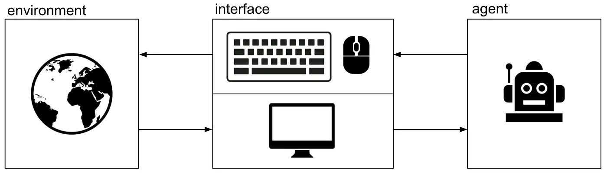
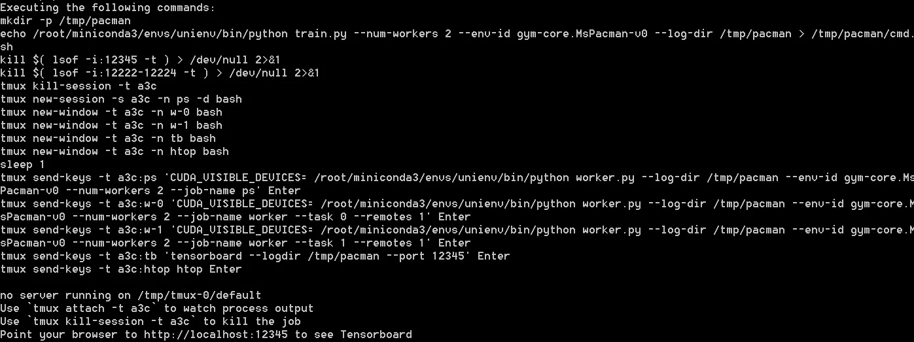
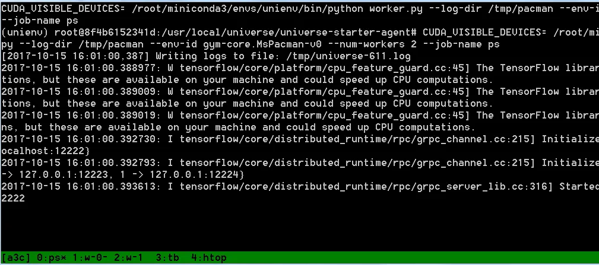
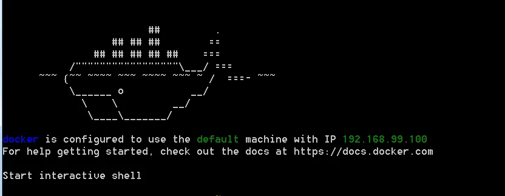
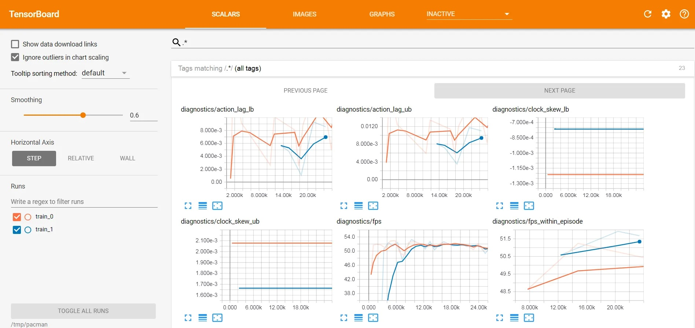
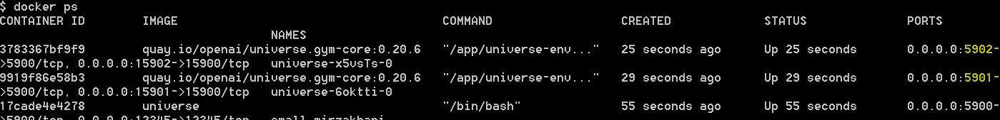
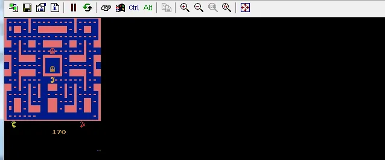

When I first heard about OpenAI Universe, I wanted to start playing around with it as quickly as possible. Universe was released as

> …, a software platform for measuring and training an AI's general intelligence across the world's supply of games, websites and other applications.



But soon I had to realize that Windows isn't probably the best OS to use as a starting point as it is currently not supported by OpenAI Universe. So my first naive idea was to setup up an Ubuntu VM and get the Universe Starter Agent going. Although my machine had a new i7 and 32 GB of memory the results were disappointing — even if I only ran 4 agents.

I've never managed to reduce the reaction time to less than 60 ms in the Pong environment.

So a guest Ubuntu wasn't the way to go. Buying a new SSD and installing Ubuntu would have taken too much time and AWS EC2 wasn't an alternative, so I decided to try out Docker.

## Setup
So I followed the instructions on the OpenAI Universe Github page:
To get started, open a Docker Quickstart Terminal as Admin and clone the universe repo:

```bash
git clone https://github.com/openai/universe.git
cd universe
```

Build a docker image, tag it as 'universe':

```bash
docker build -t universe .
```

If the error "Error response from daemon: client is newer than server (client API version: 1.24, server API version: 1.23)". pops up, you may have to run the following command to circumvent an issue due to an older Docker Toolbox Installation on Windows 7:

```bash
export DOCKER_API_VERSION=1.23
```

The next step is to start a container from universe image. The -p switches are used to redirect the ports of Tensorboard and the VNC outputs to access them from your Windows machine later on.

```bash
docker run --privileged --rm -it -p 12345:12345 -p 5900:5900 -e DOCKER_NET_HOST=172.17.0.1 universe /bin/bash
```

Because of the -it switch and the /bin/bash command you should find yourself in a pseudo tty pointing to the directory /usr/locasl/universe

A prerequisite for installing the universe-starter-agent is Miniconda.

Download the latest installer using wget in your container:

```sh
wget https://repo.continuum.io/miniconda/Miniconda3-latest-Linux-x86_64.sh
```

Start the installation typing:

```bash
bash ./Miniconda3-latest-Linux-x86_64.sh
```

and confirm the prompts.

Once Miniconda is installed, follow the installation instructions given on [https://github.com/openai/universe-starter-agent]

```bash
conda create --name universe-starter-agent python=3.5
source /root/minconda3/bin/activate universe-starter-agent
apt-get install -y tmux htop cmake golang libjpeg-dev
pip install “gym[atari]”
pip install universe
pip install six
pip install tensorflow
conda install -y -c https://conda.binstar.org/menpo opencv3
conda install -y numpy
conda install -y scipy
```

Now you have everything installed to start using the universe-starter-agent. It's a good time to commit the changes to your universe docker image.

Run docker ps to get the container id, then run

```bash
docker commit <CONTAINER_ID> universe
```

## Test Run
Make sure you're in the universe-starter-agent folder and in the correct conda environment by running the following command in your container bash:

```bash
cd universe-starter-agent && source /root/miniconda3/bin/activate universe-starter-agent
```

Start Pacman to see if everything is working correctly by running:

```bash
python train.py — num-workers 2 — env-id gym-core.MsPacman-v0 — log-dir /tmp/pacman
```

Now you should see a similar output on your screen:



You can now issue the command tmux a to browse through the different sessions that were started to make sure the workers are running correctly. When starting the workers for the first time, they'll pull a container with all the necessary tools needed, which might take a couple of minutes.



In tmux you can change between the different processes (workers, tensorboard, orchestrator and htop) by entering `CTRL+b [0–4]`. Return to bash by pressing `CTRL+b d`.

## Watching your Agents Play
If the workers are running correctly and your agents start training, you can view the details in Tensorboard from your Windows machine's browser. The only thing you need is the IP your Docker is running with. You can see the default machine's IP when starting a new Docker Quickstart Terminal:




Just enter `<YOUR_DOCKER_IP>:12345` and Tensorboard should open up.



To view the agents playing, use the VNC viewer of your choice and connect it to one of the VNC ports. You can get ports by running docker ps in your Docker Terminal. This returns a list of your primary container and the child containers with your workers. Each worker routes its VNC port 5900 to a free port e.g. 5901 as shown in the figure below.



When connecting to a VNC output, enter openai as password and you should see the agent playing.



Entering tmux kill-session will stop your workers. If you want to reuse your models in a next training session, think of mounting your Windows filesystem to docker to transfer the log-dir contents to your local machine.

-----

I hope my little how-to supported you to get OpenAI universe running on your Windows machine.

If you enjoyed this post, please let me know. Follow me on [Medium](https://medium.com/@8B_EC) for the latest updates or just to say hi.

> Image source: [https://www.flickr.com/photos/textfiles/27228418683/](Image) licensed under the Creative Commons Attribution 2.0 Generic