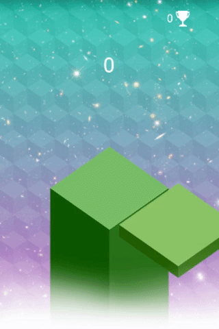
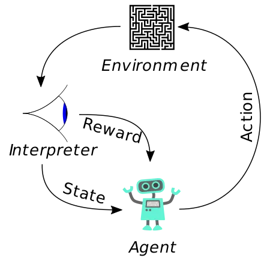
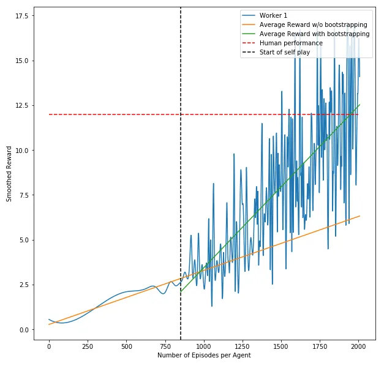

In my last post, I wrote about µniverse, a great framework for training game agents using Reinforcement Learning. After training a lot of agents and playing around with µniverse, I found out that training my agent on the game StackTower is not working as good as for other games like e.g. Doodle Jump.

The goal of StackTower is to stack as many blocks as possible on the platform. Each block fades in from east → west or north → south. Once the block reaches a good position, one can drop it by pressing a key. On the left you see me playing the game. I had luck with my first block, but the consecutive blocks were badly positioned.

Before we dive into the issue, the agent is facing in this game, let's have a quick recap of Reinforcement Learning.

-----

Reinforcement Learning consists of five basic concepts:

1. The **Agent**, our actor who is looking to maximize its reward for actions in a given environment.
2. An **Environment**, which serves as a place for our actor to act in and discover, e.g. a game like Super Mario.
3. A **State**, that describes the current status of the environment.
4. **Actions**, which can be performed by the agent to change the state in an environment, like jumping to get a coin in Super Mario.
5. The **Reward**, that could be earned by performing a certain action in a given state.

-----

Applied to StackTower we can see that the reward for this game is quite tricky. As humans, we intuitively know that the (long-term) reward is somehow related to our timing. The better the timing, the bigger the part of the block that remains on the platform. But this information is reflected nowhere in the game score. Whether the whole block is placed on the platform or just a part of it, the score will always be increased by one. Our agent might be able to learn this relationship, but it will take a lot of game episodes to do so.

-----

I've analyzed the reward as a function of episodes for StackTower as it can be seen in the following plot. For the episodes that were played by the agent without any bootstrapping (the ones left to the black line), we can see that the reward curve stays pretty flat. Especially when assuming this growth rate for the following episodes, we could expect an average reward of 6 per episode after playing 2000 episodes (orange line). Which means that the agent is able to stack up 6 blocks on top of each other after learning from 2000 episodes.

-----

On my machine this would take roughly 48 hours, so I wanted to speed up the whole process by supporting the agent. Therefore I've been using @unixpickle's Demoverse to record my gameplay. The best score I was able to achieve on my machine, was 12 stacked blocks (red line in the plot). The average stack size was around 9. So I took 10 game recordings and used them to train the agent's policy on those. As we can see in the above chart, the agent started to rapidly increase its average reward after updating the policy (the curve right to the black line).

And this is the agent playing StackTower after training on 2000 episodes, using bootstrapping after episode 800.

-----

If you enjoyed this post, please let me know. Follow me on [Medium](https://medium.com/@8B_EC) for the latest updates or just to say hi.
