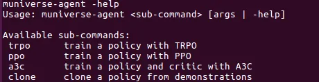
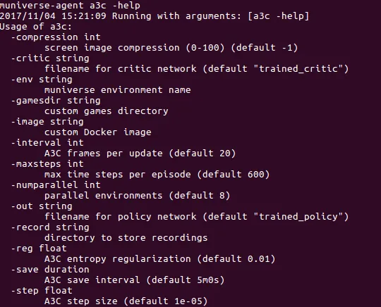
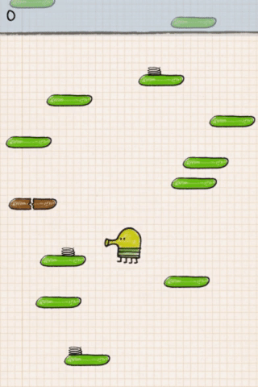

After working a couple of weeks with OpenAI's Gym and Universe I'm still very excited to discover and learn all possibilities to train RL agents using those frameworks.

Unfortunately, it seems that there isn't a huge community actively using Universe. I don't know whether that's related to the specific topic of RL or the challenges that come up when working with Universe due to its specific architecture as mentioned e.g. by Alex Nichol:

> … the biggest problem with Universe is that VNC and Flash need to run in real time. This means that any hiccups on your training machine […] might suddenly change the frame rate at which your AI experiences its virtual environment.

Therefore I was looking out for solutions to performance issues I faced when running more complex environments in Universe and came across µniverse. µniverse is developed by Alex Nichol aka unixpickle and providing environments to train RL agents for HTML5 games, which should improve the overall performance and complexity as RL agent training & development framework.

## Installation

The installation of µniverse is pretty straightforward and documented on the µniverse Github page.
Unixpickle also developed a µniverse-agent which provides ready-to-use agents based on popular concepts like PPO, TRPO, A3C.
Available parameters can be shown by typing the following commands:

Algorithm-specific parameters can be found by typing:

## Training an Agent

I've chosen Doodle Jump as the first game to train A3C agents on, but you can choose from all games provided by µniverse. They can be found in the µniverse games folder. The naming is somehow similar to the naming conventions used in OpenAI's Gym.
To start the training process, the following command can be used:

muniverse-agent a3c -env DoodleJump-v0 -out doodlejump >> log_doodle.txt 2>&1
The first and second parameters are pretty self-explanatory.

The out parameter provides a name where the trained policy is stored to and can be loaded from to continue training.

At the end of the command >> log_doodle.text 2>&1 is forwarding the output of the µniverse-agent to a log file we'll use for performance analysis in a next article.

## Observing the Agent

While the training is running you might have taken a look into the muniverse-agent's folder to search for some kind of visualization of the agent's current state. One way to get an understanding of the agent's performance is to take a look at the log file created in the previous step. Another way is to visualize the agent's interactions with the environment. In our case the Doodle Jump gameplay.

This can simply be done by stopping the training and adding the flag -record <PATH_TO_RECORDING_FOLDER>. Restarting the agent will create a couple hundred images containing "screenshots" of the agent's game play.

## Next Steps

In the next article I will show you an easy way to visualize the agent's performance based on the logs we've created in this little tutorial. I'm really looking forward to see what kind of frameworks unixpickle, OpenAI and other companies will work on in the future.

-----

If you enjoyed this post, please let me know. Follow me on [Medium](https://medium.com/@8B_EC) for the latest updates or just to say hi.
