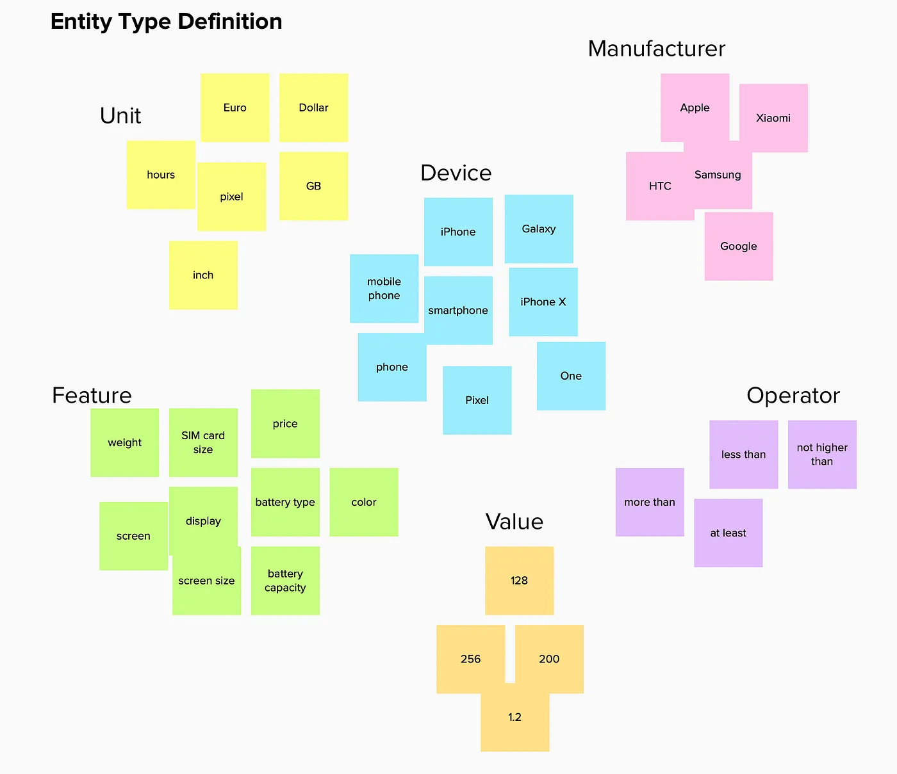

Co-Authored by Christina Niegel and Jan Forster

One of the IBM Watson services that allow a very deep understanding of complex natural language is [Watson Knowledge Studio](https://www.ibm.com/cloud/watson-knowledge-studio) (WKS). It helps users to design and develop Machine Learning annotators trained on understanding a domain language, not only regarding specific terminology but also underlying related information. Accessing not only strings and keywords, but context-sensitive information can unlock the semantic meaning of terms and phrases and helps to concentrate on what's relevant for the goal of the NLP application.

-----

## A Type System?

A Type System is the abstract representation of information that is relevant within the domain and will be the guideline for the "human annotators". They are going to train the system and help WKS to learn what to do with text.

For all those who already developed annotators with WKS, it's nothing new when we say: a well-designed Type System can decide about the success or fail of your WKS project. Creating a Type System is often a challenging task and underestimating it can turn out in non-scalable solutions and unsatisfied users of the end product.

Unfortunately, contrary to common beliefs, we have to admit that there is no recipe for a universal Type System — sorry. The number of different Type Systems varies as much as there are business problems and domain languages. But even if there's not a single solution that solves every problem, we'd like to share our approach that can ease the process of building a feasible Type System.

## Use Case Example

Imagine yourself being in a situation where your client, a large smartphone retailer, wants to allow his customers to find smartphones with their natural language using a chatbot. People might ask the following questions to find a suitable smartphone:

"Which iPhone can I get for less than 500 dollars?"
"Which phone has more than 4GB of RAM?"
"How many pixels does the Pixel have?"

Your client needs to extract the relevant information from the customers' questions to provide only smartphone suggestions that meet their criteria.

## Goals of this Blog Entry

Given this use case, we want to share our experiences of the domain adaptation process:

Share our method to build a robust Type System that is focused on the business requirements and outcome. Questions to ask yourself: What are the entities and relations I need to recognize and extract to achieve the business goal?
Support you in abstracting away from a specific example towards a scalable Type System design process.
Underline the importance of the mantra: "Consistency is key".

-----

## WKS Terminology

Before we get started, let's make sure we are using the same terms in the form of a "mini glossary". More info can be found in the official WKS documentation.

### Type System

The Type System defines elements you want to label using annotations. It defines how content can be annotated using entities and relations.

### Mention

A mention is a span of text that you consider relevant in your text.

### Entity Type

An Entity Type is a category you want to be able to recognize in your text to solve your business problem. A mention in the text that belongs to a particular Entity Type is called Entity Mention.

### Entity Subtype

Entity Subtypes allow the further refinement of Entity Types.

### Relation Type

A Relation Type defines a directed relationship between two entities within a single sentence.

## What is MURAL?

No, we're not traveling back in time to the Stone Age. MURAL is an online collaboration whiteboard platform. When we met in client engagement in 2018 after working on various NLP projects involving Watson Knowledge Studio and Watson Discovery Service, we came up with the idea to try out MURAL for our domain adaptation process. We both liked using it for Design Thinking sessions before, so we gave it a try.

## The Flow

### Corpus Studies

Before you define entities or relations, you should always read through the domain corpus and other existing language artifacts while having the business problem in mind. This takes time and is a tedious task, but it is necessary. Free your mind from any "common" Entity Types that you might have already in mind just because you know that domain. This can be misleading and brings a bias to your Type System right from the beginning.

### Mention Collection

Post the relevant mentions that occur during your "corpus studies" to your MURAL board.

In our example, this could be terms and phrases collected from end-users that want to find a new smartphone.

### Entity Type Definition

When you have covered a representative set of mentions on your board, start to cluster and align the mentions: try to give those clusters names. These would be the Entity Type names.

Referring to our initial example user question "Which iPhone can I get for less than 500 dollars?" you can see the relevant Entity Type clusters in our Type System.

### Relation Type Definition

Sketch possible relations between the entity clusters. Here it is important to keep the business goal and the value of the product in mind. The more complex your Type System gets, the more difficult it will be to train and maintain. You don't need to build a domain ontology. Focus on relations that help to solve your business problem.

In the image below you can see the possible relations between the relevant entities we defined for our use case.

### Transfer to WKS

When you are ready, transfer the Entity Types and Relation Types into WKS and start annotating some documents. It's completely OK if you run into problems regarding ambiguous mentions, unclear lengths of spans (multi-token Entity Mentions) or missing relations in the first iteration. Usually, you refine your Type System and go through the above steps again.

### Cheat Sheet

Critical mentions, that might be confusing for the team of human annotators, can be collected on a separate MURAL mention board. This board serves as a cheat sheet. It's also a great way to collaborate and document changes and extensions to your Type System. It will save time when syncing, it is easier to lookup than checking dictionaries in WKS or Excel and ensures consistency within your team and your annotations. Avoid duplicates or overlapping Entity Mentions across Entity Type clusters.

**Pro Tip 😉**
You can use icons in MURAL to highlight difficult or ambiguous examples that human annotators need to know about.

## That's it

We hope you enjoyed this kind of hands-on session creating a WKS Type System and hope it was fun to follow the use case.

If you want to build your own Type System in WKS, get started on the IBM Cloud for free today!

## About Us

Christina Niegel and Jan Forster are NLP practitioners in the IBM Watson team in Europe. We help our clients to use the full potential of our Watson products and solutions.

We hope this content was helpful to you! Please provide feedback in the comments below. If you have any questions, let us know, we're happy to help.
